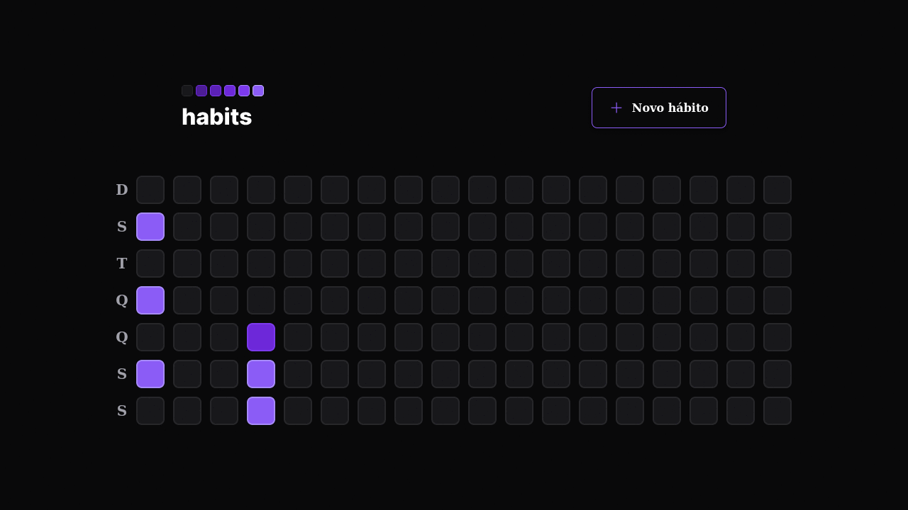

# HABITS 

O pojeto HABITS serve para gerenciar hábitos do usuário.

Author: Dev Meditation

## HABITS WEB

Esse é o APP WEB (frontend) do projeto Habits, ele é uma interface visual para o usuário cadastrar seus hábitos e monitora-los.

Esse app necessida de integração com a [habit-api](https://github.com/devmeditation/habits-web) a qual fornece meios para armazenamondo dos dados cadastrados pelo usuário.

### TECHS | LIBS

- [ReactJS](https://reactjs.org/)
- [TypeScript](https://www.typescriptlang.org/)
- [ViteJS](https://vitejs.dev/)
- [Axios](https://axios-http.com/)
- [Phor-react](https://phosphoricons.com/)
- [Radix-UI](https://www.radix-ui.com/)
- [DayJS](https://day.js.org/)
- [Zod Dev](https://zod.dev/)
- [CLSX](https://www.npmjs.com/package/clsx)
- [Git](https://git-scm.com/)
- [TaiwindCSS](https://tailwindcss.com/)
- [Service Worker](https://developer.mozilla.org/en-US/docs/Web/API/Service_Worker_API/Using_Service_Workers)
- [PushManager API](https://developer.mozilla.org/pt-BR/docs/Web/API/PushManager)

## CONTATO

- [BCL-LAB](https://youtube.com/@bcllab)

<!-- convert -delay 120 -loop 0 *.png habits-web_by_DevMeditation.gif -->